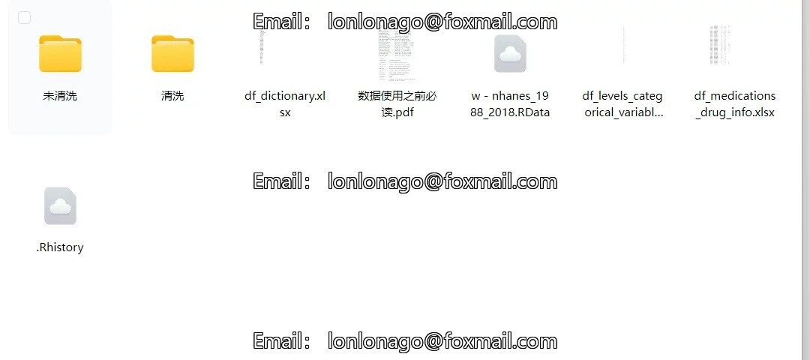
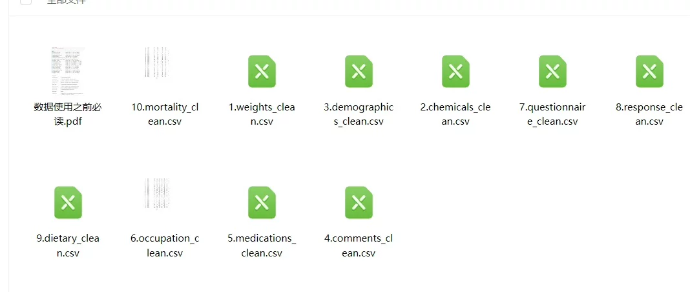
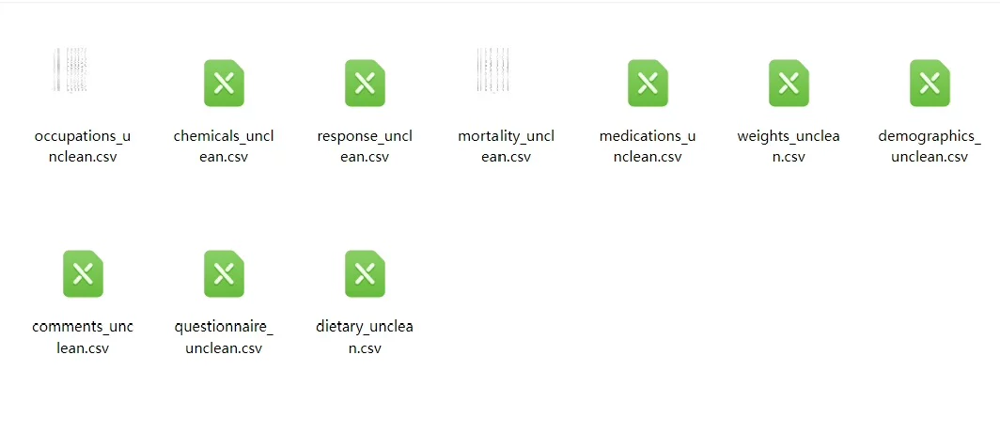
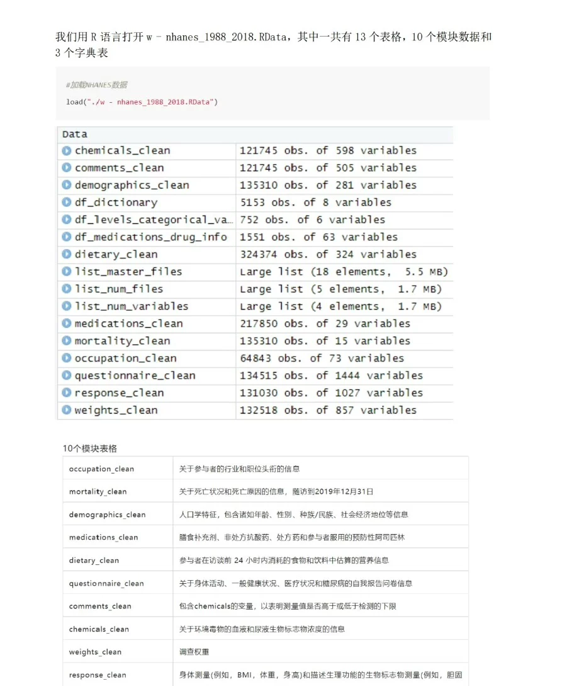

## Body

The NHANES database has been organized.

The well-organized NHANES dataset from 1988 to 2018, comprising 134,310 participants and 4,740 variables.
This data merges 614 files from the NHANES III (1988-1994) and Continuous NHANES (1999-2018).
Mortality data is also organized.
R can directly open it.
It includes Excel files, SPSS, or R can open it.
Before and after cleaning, both data sets are provided.

The main content of organization focuses on the following differences between different cycles: ① Changes in variable naming methods: The same variable may be renamed at different stages of the study or two completely different variables have the same name; ② Changes in measurement units: The same variable may use different measurement units in different periods; ③ Changes in labeling of the same categorical variable: For categorical variables, the labels of the same category may also change.

## Images

item_1064440418066

Here is a pay link on Stripe ( https://buy.stripe.com/3cs8yP7sY87d0vu9AB ). Please contact me lonlonago@foxmail.com after funding $89, and I will send you a complete data files , thank you!

